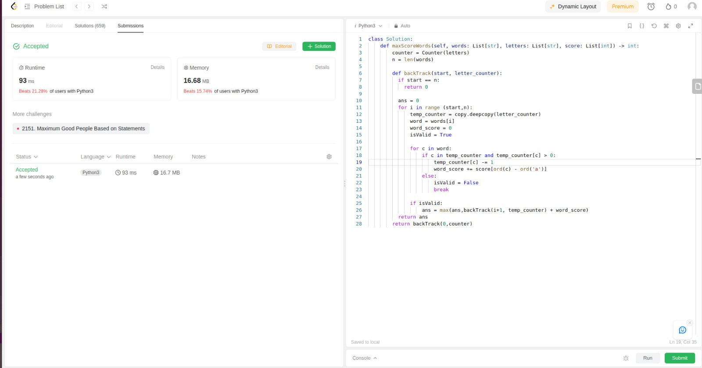
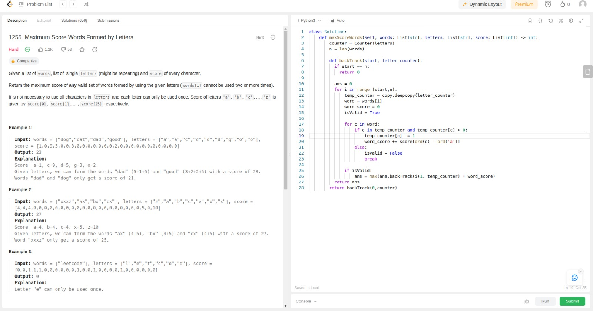
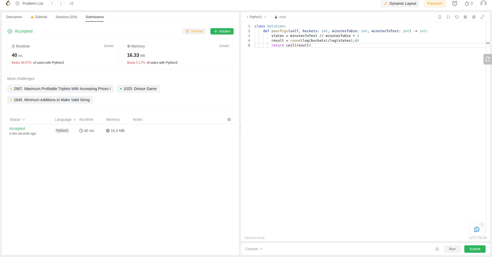
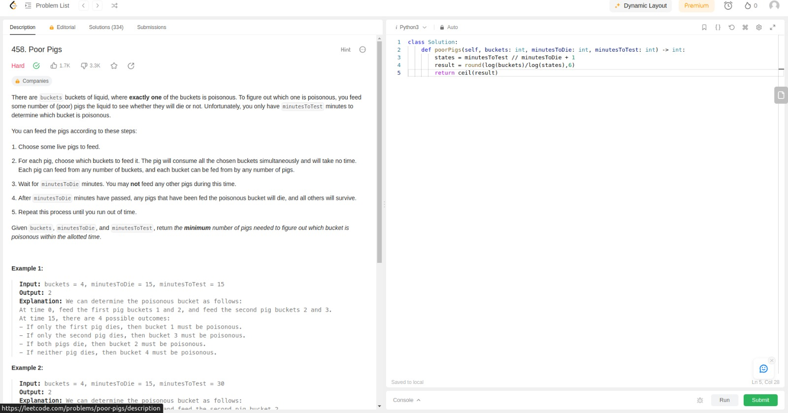
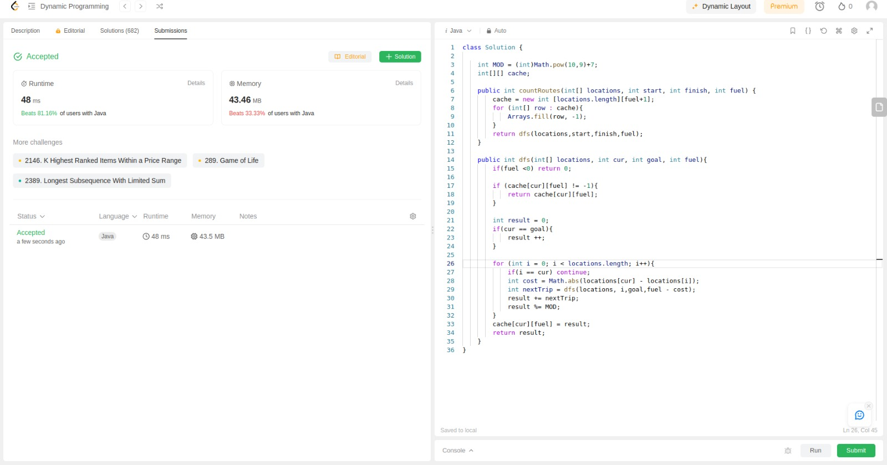
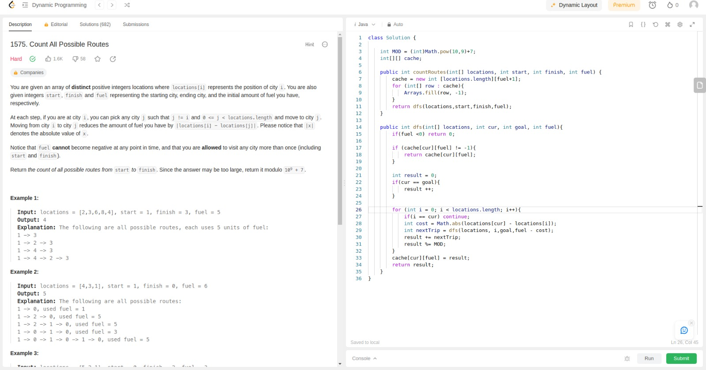

# PD_LeetProblems

# LeetCodeExercicios

**Conteúdo da Disciplina**: Dynamic Programing 

## Alunos
|Matrícula | Aluno |
| -- | -- |
| 21/1039312| Danilo Carvalho Antunes |

## Sobre 
Este repositório contém a resolução de três exercícios do [LeetCode](https://leetcode.com/)

## Exercício 1255. Maximum Score Words Formed by Letters

Dificuldade: **Hard  **
Link: [Exercício 1255. Maximum Score Words Formed by Letters](https://leetcode.com/problems/maximum-score-words-formed-by-letters/)

_ScreenShot1_

_ScreenShot2_

# Poor Pigs

Dificuldade: **Hard  **
Link: [Exercício 458. Poor Pigs](https://leetcode.com/problems/poor-pigs/)

_ScreenShot3_

_ScreenShot4_

# Count All Possible Routes

Dificuldade: **Hard  **
Link: [Exercício 1575. Count All Possible Routes](https://leetcode.com/problems/count-all-possible-routes/)

_ScreenShot5_

_ScreenShot6_

## [Clique aqui para ver a apresentação](...)

## Instalação 
**Linguagem**: Python 
**Linguagem**: Java 

Caso queira testar localmente é necessário ter o python e o Java instalados
## Uso 
Para verificar o funcionamento basta abrir o link do exercicio e copiar o código referente a questão, e logo após realizar o envio. Caso queira verificar localmente, é necessário adicionar a chamada da função principal com seus devidos paramêtros. para rodar basta utilizar o comando:

`python3 NomeDoArquivo.py`
`java NomeDoArquivo.java`